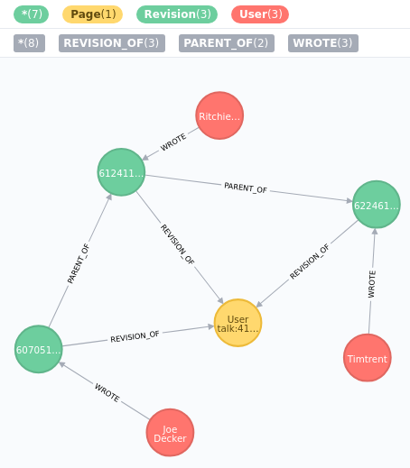

# Wikipedia Parser

A Java-Application that parses the whole history of changes on Wikipedia and builds a JSON-DB. The JSON files are much smaller than the original dump because they contain only the changes that have been made to a page on Wikipedia and not the complete text of each version of a page. 

Additionally a Neo4j-DB is filled with relational data. 

This application uses the [akka actor library](https://akka.io/). 

After cloning the repository, an executable jar is made by

```
mvn clean package
```

Useful settings of JVM-parameters are given in [Wikiparser.sh](Wikiparser.sh).

## Configuration

In [application.conf](src/main/resources/application.conf), the following parameters can be adjusted:
- wikipedia.path: local directory for downloads and DBs
- indexUrl: the Url of the Wikipedia Downloads (https://dumps.wikimedia.org)
- indexPath: path to the desired version (e.g. the one from January 1st, 2019)
- filePrefix: part of the file name that specifies the kind of dump (e.g. all pages with complete page edit history)
- lastPageId: used to skip the first pages including page with this Id

The logging can be configured in [logback.XML](src/main/resources/logback.xml). See also [online documentation](https://logback.qos.ch/manual/configuration.html).

## Data

At wikipedia.path, four directories are created.

1. log: logging files
2. original
    - downloads of Wikipedia dump: enwiki-20190101-pages-meta-history1.xml-p10p2065.bz2, ...
    - requires sufficient storage (appr. 1 TB)
3. json
    - the JSON-files: enwiki-20190101-history1.json, ...
    - requires sufficient storage (appr. ?? TB) 
4. neo4j
    - the Neo4j-DB
    - requires sufficient storage (appr. ?? TB)
    
### Format of JSON data

WikipediaParser parses through the XML files of the Wikipedia dump and extracts the changes between two versions of an article. A Wikipedia page consists of multiple revisions by different authors. The WikipediaParser collects all revisions by the same author until another author submits a revision. Only the last revision is kept and the difference to the previous revision (by another author) is calculated.

An example of the article "Talk:Atlas Shrugged" in JSON format:

```
{
	"id":"233328",
	"parentId":null,
	"timestamp":"2001-01-30T20:51:36Z",
	"contributor":{
		"id":"4938",
		"name":"TimShell"
	},
	"contributorIp":null,
	"text":"I am developing the AtlasShrugged section of Wikipedia as a test to push [...],
	"patch":null,
	"page":{
		"id":"128",
		"title":"Talk:Atlas Shrugged",
		"redirecting":false
	}
}
{
	"id":"677884",
	"parentId":"233328",
	"timestamp":"2002-02-25T15:43:11Z",
	"contributor":{
		"id":"0",
		"name":"Conversion script"},
	"contributorIp":null,
	"text":null,
	"patch":"@@ -344,18 +344,16 @@\n edias.%0A%0A\n-%0A%0A\n I chose \n@@ -902,9 +902,128 @@\n ection.[...]",
	"page":{
		"id":"128",
		"title":"Talk:Atlas Shrugged",
		"redirecting":false
	}
}
```

The first version of a page has no parentId, and the attribute "text" contains the full article. Later entries that refer to the same page link to the previous version by the parentId. Changes are given as patch: see [diff-match-patch](https://github.com/google/diff-match-patch).

Usually, the revision are ordered chronologically in the XML file. This speeds up the parsing. But sometimes, the revisions are out of order. In this case, the Wikipedia page is skipped and another parsing of the same XML file is started after completing the current one. During the second parsing, revisions of the skipped pages are collected and ordered by date before aggregation by author and calculating the differences. This approach should be avoided in general because it requires a large amount of memory (saving all revisions of a page in full text).
 
The original parentId as given in the XML file is not reliable and, therefore, overwritten.

### Format of Neo4j data

The Neo4j database contains the relational information. The attributes "text" and "patch" are not stored. Example: 


